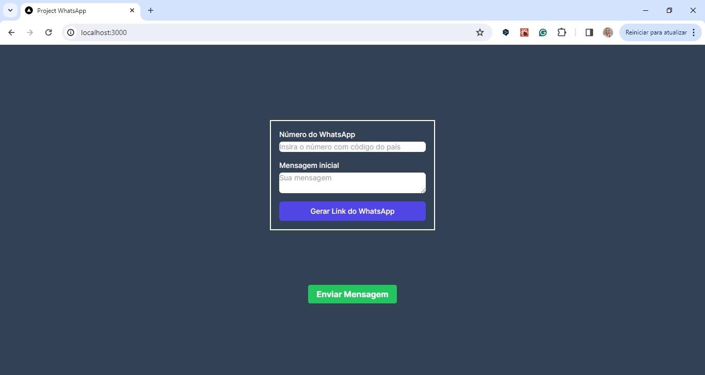

<h3 align="center"> 💻 Web_project - LinkWhatsApp - React.JS, TailwindCSS, Next.js and TypeScript </h3>

<h2 align="center"> 💻 LinkWhatsApp</h2>

 

## How to Run

* To run the project in your local environment, follow the steps below:

- git clone url-do-repositorio 
- cd nome-do-projeto 
- npm install 
- npm run dev 

Open [http://localhost:3000](http://localhost:3000) with your browser to see the result.

You can start editing the page by modifying `app/page.tsx`. The page auto-updates as you edit the file.

This project uses [`next/font`](https://nextjs.org/docs/basic-features/font-optimization) to automatically optimize and load Inter, a custom Google Font.

## Learn More

To learn more about Next.js, take a look at the following resources:

- [Next.js Documentation](https://nextjs.org/docs) - learn about Next.js features and API.
- [Learn Next.js](https://nextjs.org/learn) - an interactive Next.js tutorial.

## Technologies Used

* React.js: Used to build a dynamic user interface with reusable components, facilitating project maintenance and scalability.
  
* Next.js: Used to enhance the user experience through fast, optimized web pages, taking advantage of features such
  as server-side rendering and static site generation.
  
* Tailwind CSS: Adopted to speed up front-end development, allowing efficient and responsive design customization
  directly in the markup, without the need to leave the HTML context.
  
-------

## 🔖 Project on air
You can visualize the project on air [link](https://linkwhatsapp.netlify.app/ )

## 🔖 Git Clone
You can visualize the project [link]( https://github.com/ludiemert/linkwhatsapp.git )

---

## Contributions

* Contributions are welcome! If you have suggestions for improving the project or want to report bugs, 
feel free to open an issue or send a pull request.

---

#### Contact

#### [**Luciana Diemert**](https://github.com/ludiemert)

🛠 `Front-end` `Back-end`Developer Jr.  
📍 São Jose dos Campos – SP - Brazil

&nbsp;
&nbsp;
&nbsp;
&nbsp;

 

